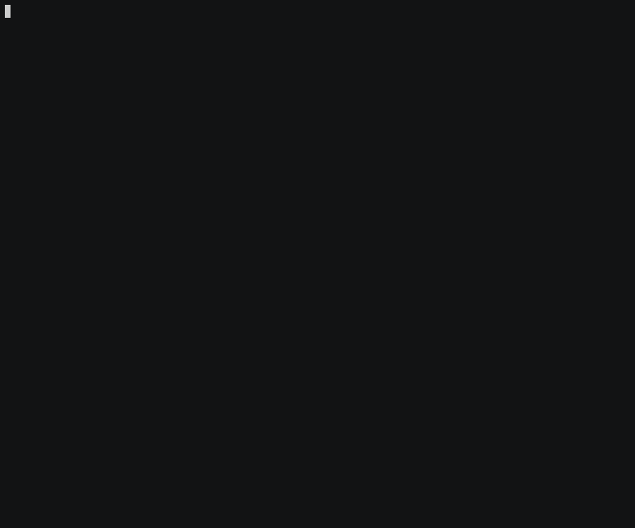

# Landmarks Starter Repository

See [Landmarks](https://github.com/LexiFi/landmarks) repository for more information about landmarks or check [dune manual](https://dune.readthedocs.io/en/stable/instrumentation.html) for information about instrumenting with dune.



## Install dependencies using opam

```
opam install -y --deps-only .
```

## Triggering the instrumentation

Use the `(instrumentation (backend landmarks))` or  `(instrumentation (backend landmarks --auto))` 
on `library`/`executable` stanza to tell dune to instrument parts of your code.

Instrumented executables check the value of the `OCAML_LANDMARKS` environnement variable to 
display the results. Moreover, the preprocessor may also read this variable to activate the 
"automatic" mode for all the code. You can use the `context` stanza in the dune-workspace 
file to set this environnement variable during both build and execution. 

### Manually

```
dune build --instrument-with landmarks ./test.exe
OCAML_LANDMARKS=on _build/default/test.exe
```

### Using build contexts

The contexts are configured in the `dune-workspace` file. 

For instance, the following commands will execute `test.exe` in the build context `profiling` and `profiling-auto`.

```
dune exec --context profiling ./test.exe
dune exec --context profiling-auto ./test.exe
```


